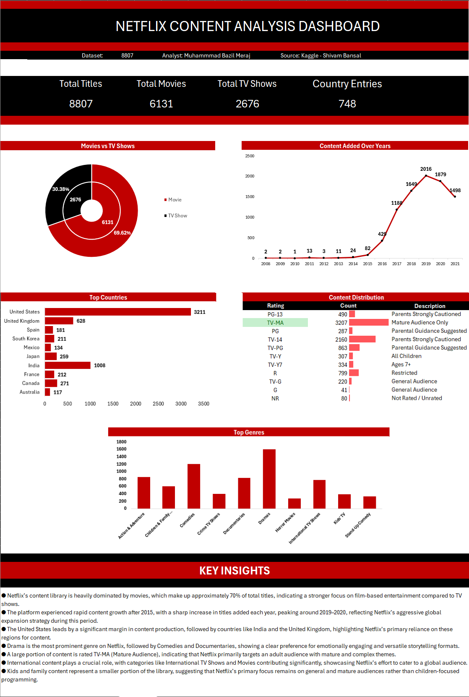

# 📊 Netflix Content Analysis Dashboard

This project presents a comprehensive analysis of Netflix's content dataset using Excel, focusing on trends, distribution, and key insights.

---

## 📁 Dataset
- Source: Kaggle (Shivam Bansal)  
- Dataset: [Netflix Shows Dataset on Kaggle](https://www.kaggle.com/datasets/shivamb/netflix-shows)  
- Total Records: 8807  

---

## 🎯 Objectives
- Analyze distribution of Movies vs TV Shows
- Identify top content-producing countries
- Explore genre popularity
- Understand content growth over time
- Examine rating distribution

---

## 📊 Dashboard Overview

---

## 📌 Key Insights

- Movies dominate the platform (~70% of total content)
- Significant growth observed after 2015, peaking around 2019–2020
- United States is the leading content producer
- Drama and Comedy are the most popular genres
- Majority content is rated TV-MA, targeting mature audiences
- Strong presence of international content

---

## 🛠 Tools Used
- Microsoft Excel
- Data Cleaning & Transformation
- Pivot Tables
- Data Visualization

---

## 📈 Features
- Interactive dashboard
- Genre and country analysis
- Content growth trends
- Rating distribution insights

---

## 👤 Author
Muhammad Bazil
